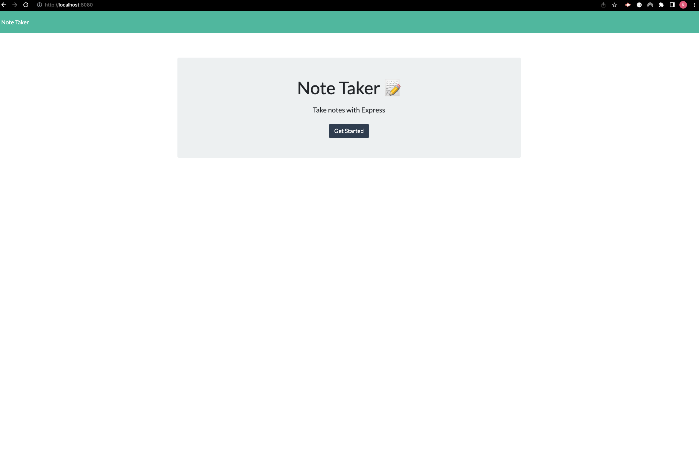

# Note-Week-11-Challenge

Module 11 Challenge

## Description

Creating a note taker to organize tasks and thoughts.
## Link

<https://kenjib32.github.io/Note-Week-11-Challenge/>
## Screenshot

## Complied Criteria

* HTML file is generated that displays Team Profile.

* Default email program opens and populates the TO field including the email address on the address bar when the team member's email has been clicked.

* Prompted to enter team members' (manager, engineer, employee, and intern) employee ID, email address, office number, and school.

* After finishing the entry, an option to add a staff member will appear.

* Option to finish the entries once finished, and the HTML will be generated.

## Repository

<https://github.com/Kenjib32/Note-Week-11-Challenge>